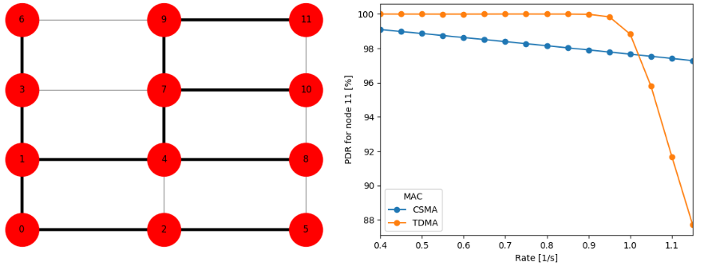

# Analytical Model for IEEE 802.15.4 Mesh Networks

The implementation of an analytical model for the assessment of multi-hop networks using the IEEE 802.15.4 standard. The focus is on the Media Access Control (MAC) layer. It supports CSMA/CA as well as TDMA techniques such as TSCH and DSME.

## Literature

Florian Meier, Volker Turau. Analytical Model for IEEE 802.15.4 Multi-Hop Networks with Improved Handling of Acknowledgements and Retransmissions. arXiv:1501.07594 [cs.NI]. <a href="https://arxiv.org/abs/1501.07594">https://arxiv.org/abs/1501.07594</a>

Florian Meier, Volker Turau. An Analytical Model for Fast and Verifiable
Assessment of Large Scale Wireless Mesh Networks, in Proceedings
of the 11th International Conference on the Design of Reliable Communication Networks (DRCN). Kansas City, MO, USA, Mar. 2015. <a href="http://ieeexplore.ieee.org/document/7149011/">http://ieeexplore.ieee.org/document/7149011/</a>

## Installation

The program is based on the <a href="https://www.mcs.anl.gov/petsc/">Portable, Extensible Toolkit for Scientific Computation (PETSc)</a>. So the first step is to install it according to this <a href="https://www.mcs.anl.gov/petsc/documentation/installation.html">documentation</a>. For Linux with APT and Bash it basically boils down to:

    sudo apt-get update
    sudo apt-get install git build-essential gcc g++ gfortran python
    cd ~/
    git clone -b maint https://bitbucket.org/petsc/petsc petsc
    cd petsc
    echo "export PETSC_DIR=`pwd`" >> ~/.bashrc
    echo "export PETSC_ARCH=linux-gnu-c-debug" >> ~/.bashrc
    source ~/.bashrc
    ./configure --with-cc=gcc --with-cxx=g++ --with-fc=gfortran --download-mpich --download-fblaslapack
    make all test

Now to the software in this repository:

    sudo apt-get install libboost-graph-dev libboost-program-options-dev libboost-system-dev libboost-filesystem-dev
    cd ~/
    git clone https://github.com/koalo/AnalyticalMultiHop analyticalmultihop
    cd analyticalmultihop
    make

The program is now ready to use. However, if you want to use the Python interface (see below), the following steps have to be executed, too:

    sudo apt-get install python3 python3-pip graphviz libgraphviz-dev pkg-config libfreetype6-dev
    sudo -H pip3 install virtualenv
    cd ~/analyticalmultihop
    virtualenv -p python3 ./amenv
    source ./amenv/bin/activate
    pip install -r ./requirements.txt

## Quick Start

The main executables are <code>csma_model</code> and <code>tdma_model</code>. They are started with several files that define the model parameters, the topology and the schedule. Besides manual creation there are two possibilities to automatically generate these files: A Python interface and a C++ based preprocessor. The first one is more easy to use and to extend. The second one is faster and more suitable if you want to analyze networks with hundreds or thousands of nodes. In the following the Python interface is used.

Activate the virtualenv. You have to do this every time you start a new terminal.

    source ~/analyticalmultihop/amenv/bin/activate

Start the quick start script with

    cd ~/analyticalmultihop
    ./quickstart.py

After some seconds, two figures should be shown that look similar to the ones above. In this example, every node in the network sends Poisson distributed traffic with a given rate to node 0. The plot shows the probabilities that a packet sent out by node 11 is successfully forwarded to node 0. When using the CSMA MAC layer, many packets are lost due to collisions. For TDMA, all packets arrive for lower rates, but as soon as the network is saturated, the queues overflow and the PDR drops sharply.

Have a look into the <code>quickstart.py</code> file to learn how to generate new topologies or schedules. If you have any questions or a scenario you want to evaluate, do not hesitate to contact me at <a href="koalo@koalo.de">koalo@koalo.de</a>. 

